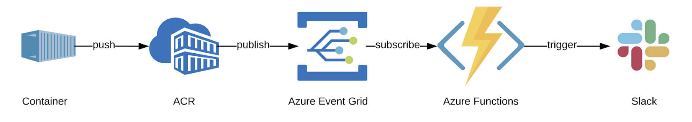

# EVENT-DRIVEN TRIGGER EXAMPLE FOR CONTAINER REGISTRY

---


---

* [High Level Overview](#High-Level-Overview)
* [Directory Structure](#Directory-Structure)
* [Setup](#Setup)

---

## High Level Overview
This repo is to show an `event-driven architecture` with its simplest use case: `pub-sub model`.
`Azure Container Registry` is one the publishers of the Event Grid, and we want to filter a specific event `Image.Push`. As event handler `Azure Functions` will pick up the event and process to send Slack notifications when an image pushed to `Azure Container Registry`.

---

## Directory Structure

```folder
📦newfuncs
 ┣ 📂ACRFuncs
 ┃ ┣ 📂.python_packages
 ┃ ┣ 📂AcrEventGridFunc
 ┃ ┃ ┣ 📜__init__.py
 ┃ ┃ ┣ 📜function.json
 ┃ ┃ ┗ 📜post.json
 ┃ ┣ 📜.funcignore
 ┃ ┣ 📜host.json
 ┃ ┗ 📜requirements.txt
 ┣ 📂img
 ┃ ┗ 📜TriggerPipeline.png
 ┣ 📜.gitignore
 ┣ 📜README.md
 ┗ 📜azure-pipelines.yml
 ```

---

## Setup

### Requirements

1. A webhook url: I used Slack Incoming Webhook Url

2. A pipeline to set up `Azure Container Registry` to send the events and `Functions` to handle the events subscribed to `EventGrid`.

### Setup of Pipeline

To run this demo in your Azure subscription, you need these variables to be set up on Azure DevOps pipeline:

1. DevOps Pipeline

    Fork this repo and create a new pipeline referencing your fork. It will create pipeline from the yaml in the source code.

2. Azure Connectivity:

    Set up a Service Connection for Azure Subscription called : `azureSubscription`. As yaml reference as a variable it should be the same name.  

3. Create variables for your pipeline:
    | Variable | Description |
    | --- | --- |
    | `acr_name` |  Name of Container Registry. For simplicity ACR will be created on the same resource group/location as other resources. |
    | `event_subscription_name` | The subscription to be created listening ACR and handled by the Azure Function. |
    | `functionapp_name` | Name of the FunctionApp to hold all the functions. |
    | `function_name` | For this repo, it should be the name of the folder `ACRFuncs` where the Python function code is located. Azure functions is opinionated about folder structure. |
    | `region` | The location of ACR, Resource Group, Azure Functions, Storage Account for Azure Functions will reference this location. |
    | `resource_group_name` | The name of the resource group, all resources for the demo will be in this resource group. |
    | `slack_image_push_url` | The webhook url for the Slack message to be pushed. |
    | `storage_account_name` |  The globally unique storage account name for FunctionApp to store diagnostic logs. |

### Test

To test the notifications, you can use the script below. It creates an image and pushes to the registry.

```bash
echo FROM hello-world > Dockerfile
REGISTRY="<REGISTRY>"

count=1
az acr build --image demo/hello-world:v${count} \
    --registry $REGISTRY \
    --file Dockerfile .
```
